# Game Design Document

### Table of contents
* [Project Name](#project)
* [Game Overview](#game-overview)
* [Story and Narrative](#story-and-narrative)
* [Gameplay Mechanics](#gameplay-mechanics)
* [Levels and World Design](#levels-and-world-design)
* [Art and Audio](#art-and-audio)
* [User Interface (UI)](#user-interface-ui)
* [Technology and Tools](#technology-and-tools)
* [Team Communication, Timelines and Task Assignment](#team-communication-timelines-and-task-assignment)
* [Possible Challenges](#possible-challenges)
* [References](#references)

### Project

        
        

<em>Game Play Screenshot.</em>

_Exp-7X42_  is a 5-min timed survival first-person shooting (FPS) game set in a virtual world.
The operators of the experiment is scientists from the real world, while the player is a test participant by the directors
of this experiment. The brain of the player is connected to machines that simulate the test environment, so that their
reactions can be examined by scientists. They have established a standard. Only those who are able to survive for more
than 5 minutes are considered as successful, which means they will remain alive and ready to participate in the future
experiments, otherwise they will be abandoned and executed with death if they fail. You, as one of object being tested,
is required to survive from this 5 minutes simulation hosted by immortal scientists, while seeking for resources and avoid
 getting killed by the enemies. The background of the game will be revealed gradually as the game progresses, which leaves
 space of imagination for the players themselves to consider.

More information are explained in the background story.

### Game Overview

#### Core Concept: 
The game is based in a chemical plant. The player is a “guinea pig” of an immoral organisation. The main goal for the player is to survive for 5 minutes under the attack of enemies, meanwhile searching for resources to stay alive. 

The background story is inspired by the novel Hunger Game, written by Suzanne Collins, where the main characters are put into a dangerous environment by an organisation and they need to fight for survival.

        
        

<em>Game World Prototype.</em>

#### Genre:
This is a single-player, First-Person Shooter (FPS), survival game.

A reference game in this genre is _bioshock_.
#### Target Audience: 
The target audiences are between the age of 15-30 who enjoys: slight-horror, slight-mystery, action game, FPS, 3D game experience, sci-fi theme.
#### Unique Selling Points (USPs): 
There are minimal explicit explanations of the background story given to the player in the game. However, there are little pieces of writings (e.g. notes, diary pages, marks on the wall) that the player might see or find when exploring the world. These can give the player some hints or implications of why he/she is in this place (hints might include fragmented information about the immoral organisation, or news articles about the experiment that the organisation is doing, or even the background story of the player). 

Players can build up their understanding about the background story based on the writings they find, but it should be quite open-ended so different players can have different interpretations about the background story; or they might have different understandings the second time they play the game.

Further information and usage regarding this USP's performance within the game play will be explained further in this document.

  

<em>hidden story.[1]</em>

### Story and Narrative
#### Background:
Backstory and settings: In the future world, some unethical scientists are investigating the adaptability of the human brain in the cyberworld using humans as experimental subjects. Their consciousness is projected into a dangerous virtual world constructed by the scientists. Death in the virtual world means death in real life. The main character is a subject of the experiment and has to fight and survive the attack of hostile creatures in a chemical plant in the virtual world.

        
        

<em>background concept.[2]</em>

#### Conflict: 
The main conflict is between the player and the hostile creatures. 

#### Progression: 
There is not a dominant story component that is enforced on the player to experience. However, clues of the background story are hidden in the surroundings and players can choose to unfold the plot based on their interests.

        
        

<em>USP - Notes.</em>

#### Notes (USP):
We have 15 pieces of notes that is organised and located within the game world, while each piece of notes contain a little word to reveal about the background story. Here is the list of all notes:

> Experiment Report 344:
>> Topic: Self adaptive Evolution
>> Object: sample 600
>> There is no evidence of evolution as we adjust the difficulty towards maximum
>> Status: Failed
>> Result: Executed
>> Conclusion: Further experiments need to be performed
>> Suggestion: expand the environment and perform more sample tests
>> Perfomance Details: the s... (Deleted)

> 7fuw032t()%#)@#H%#(Memory Leak__
>> New Message:
>> Time: 12:24
>> Today, the first tested object has passed the test
It is a miracle, we won't tell it anything
Save yourself in the real world

> There is no exit to this place unless you escape your mind...

> Do not trap yourself, save yourself

> Leave from here after the 5:00
>> don't corporate here

> You cannot kill the boss,
>> It is programmed to kill you

> You are the real one being tested...

> Profile:7X42
>>Agility: 20
>> ecpected chance: 0.01%
>> difficulty: highest
>> ... in the previous round, 7X42 has been performed with excellency

> We must stop it from taking out the knowledge...
>> This factory has been built with a program from our supercomputers

> 2:30 is the final limit, we must shut it down

> We don't want to let it know the facts

> We need to expand our )(&#$(%(#&%, and secretly monitor this sample
and to program a even more hostile creature to &*R#((@#NRNJ
(This message is confidential)
two T**(Y#(#)@$)(%&#)

> The boss will call out all minotaurs

> Make sure you have enough resources to save yourself

#### Characters:
##### Player 
an experimental subject of scientists who needs to survive in the experiment 

##### Minotaur: 

Normal monsters that attack player, only short-range attack.

These hostile creatures have different specialties. 
Some move with faster speed, some have higher health, some have wider range for movement and attacking, some have strength in combat. Hostile creatures can only have close combats.

When the player is within the attacking range of hostile creatures, the hostile creatures would attack automatically.

        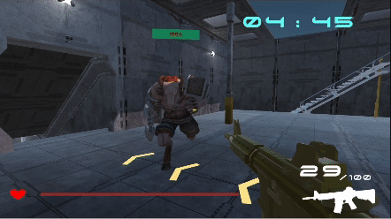
        

<em>minotaur in game.</em>

##### Boss: 

It can attack player via remote attack and range attack or normal attack.

        
        

<em>boss in game.</em>

The boss can always track the player’s movement and will chase the player. 

When using jump attack, it is able to hurt player when performing the attack within certain range to player.

When using remote attack, it will generate a blade that fly towards the player, hurting player once the blade hits.

### Gameplay Mechanics 

        
        

<em>Shooting gameplay.</em>

#### Player Perspective: 
First-person perspective.

The field of view is limited to what the character naturally sees, with the camera representing the character's eyes. Camera view can be rotated.  
    
Player character’s body is not visible on screen. However, the gun and the hand holding the gun will be visible at the right-bottom corner. Similar to the picture below:
    

        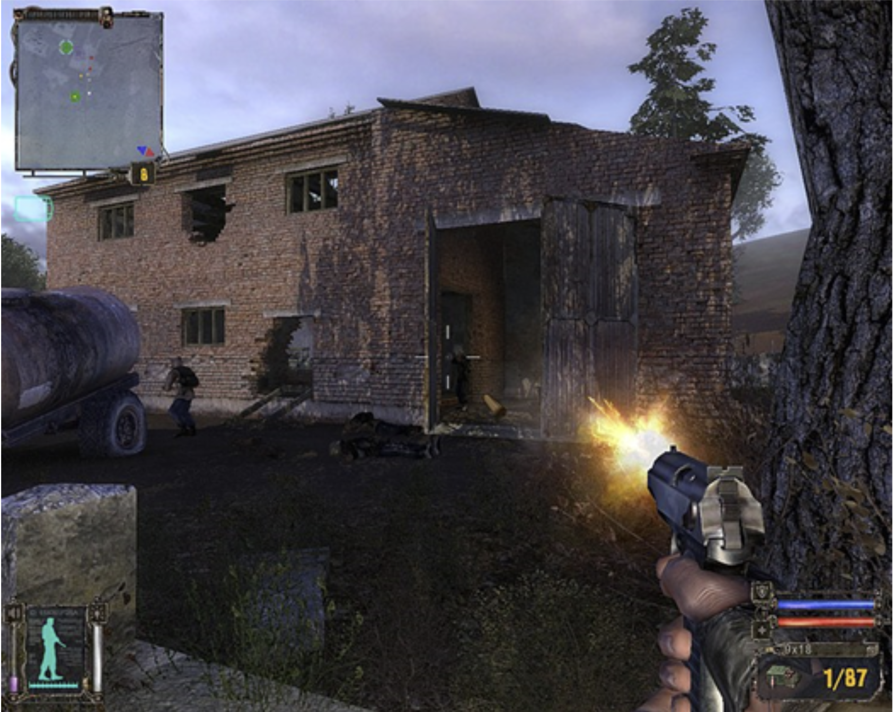
        

        
<em>Player View Concept.[5]</em>

        
Reason: Better immersive experience as the player experiences what the character sees. Also makes it easier to aim and shoot. 

        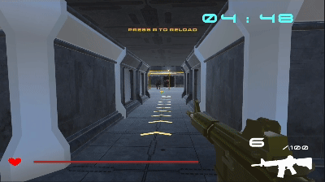
        

<em>Reload Bullets animation.</em>

#### Controls: 
Move mouse: rotate view, camera view direction is tied to movement of mouse

W A S D: move forward, left, back and right

Left click: fire the gun

E: interact with object (such as notes, supply crates, etc.), only appears next to an interactable object when character is close to the object

F: interact with object (collect crate items, hide notes)

R: refill bullets

Space: Jump

Q: switch gun (only when the player is in the interactive region)

        
        

<em>Controls Concept.</em>

#### Progression: Game can be roughly separated into two phases.

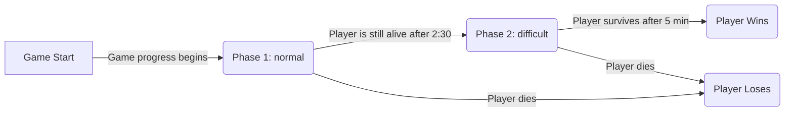
```mermaid
graph LR
    A[Game Start] -->|Game progress begins| B(Phase 1: normal)
    B --> |Player is still alive after 2:30| C(Phase 2: difficult)
    B --> |Player dies| E(Player Loses)
    C --> |Player survives after 5 min| D(Player Wins)
    C --> |Player dies| E
```

##### Phase 1 - normal:
Certain number of hostile creatures to be maintained the game and start wandering around the map (instantiate new when one gets killed).
        
In this phase, player can explore the surroundings and collect supplies (bullets, healing potion, etc) from supply crates in the scene.
        
When the player is close to a hostile creature, it will start chasing and attacking the player. Player can either escape or kill the creature with gun.

##### Phase 2 - difficult:
A boss and a set number of new hostile creatures appear in the map.
        
Boss begins chasing the player and has a number of attacking methods.
        
The boss cannot be killed but only frozen (when the player shoot the boss)

##### Losing condition: 
When the health bar is empty, the player loses
.
##### Winning condition: 
If the player is still surviving after 5 min, the player wins.

##### Gameplay Mechanics: 
Limited resources: Player can loot crates and collect resources (such as bullets) to help them survive 5 minutes. However, boxes with supplies don’t respawn and bullets can run out if player don’t use them wisely.

        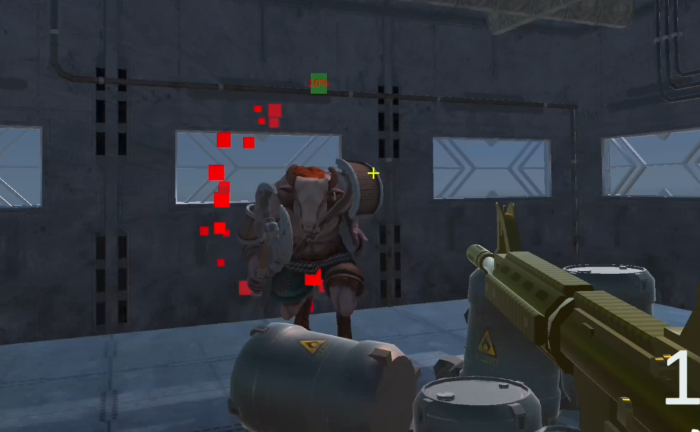
        

<em>Minotaur getting hit by bullet.</em>

    
Player Shooting Skill: The game requires precise and responsive aiming.
    
Fast reaction: Player has to react fast to attack signals in order to dodge attacks from all hostile creatures and the boss. Being able to skillfully survive under enemy pressure gives a sense of accomplishment.

Supply crate interaction: open, close, containing resources (e.g. bullets, healing potion) , provide resources for players to progress the game.

Supply crate generation: When the supply crates existing are below a specific minimum value, new crates will be generated.

Structures: walls, interior settings, floors, set limitations and plot of the environment. Moving objects are unable to directly pass through
    
Minotaurs: Their role is to stop the player from staying alive. They are able to chase and attack the player by using axes or throwing stones. They will walk separately from each other. New minotaurs will be generated when boss is out from the cage.
    
Boss is able to throw out more minotaurs, or execute remote attack object via swiping or range attack object via jumping.

        
        

<em>Boss getting released from cage.</em>

Boss cage: Once the predetermined time of locking the boss is passed, the cage will rises up and release the boss.
    
Player: The player is able to open supply crates, and kill minotaurs via shooting. A bullet will be generated. If it hits the enemy, the enemy's health will be deducted.

        
        

<em>Open Crate and Collect item.</em>

    
Supplies: Potions, bullets. They are located inside crates, players will equip the items automatically once opening a crate. The equipped items can be consumed by the player at any time during the game by pressing the related. 

        
        

<em>Health Potion.</em>

Health Potion: When the player equips health potion and uses it, it will gradually increase the health level of the player.

        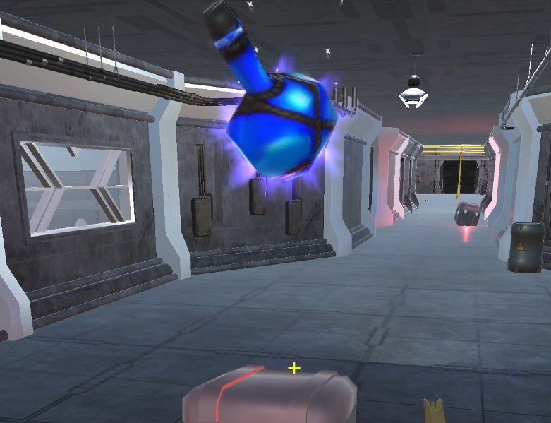
        

<em>Speed Up Potion.</em>

Speed-Up Potion: When the player uses the speed-up potion, it will increase the player's speed to a faster level and remain at the level for a certain amount of time. Once the time of the potion is reached, player's speed reset to the original level.

        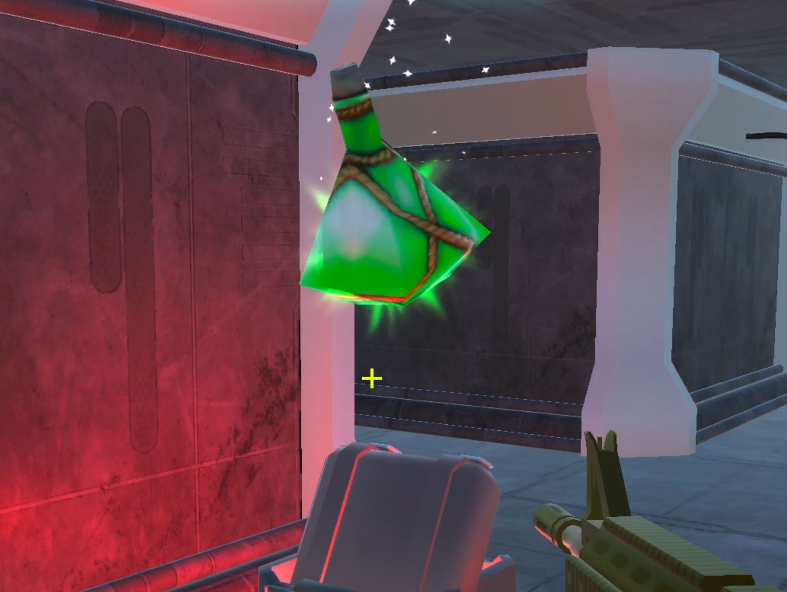
        

<em>Damage Potion.</em>

Damage Potion: When player uses the damage potion, it will increase the damage of bullets on enemies.

        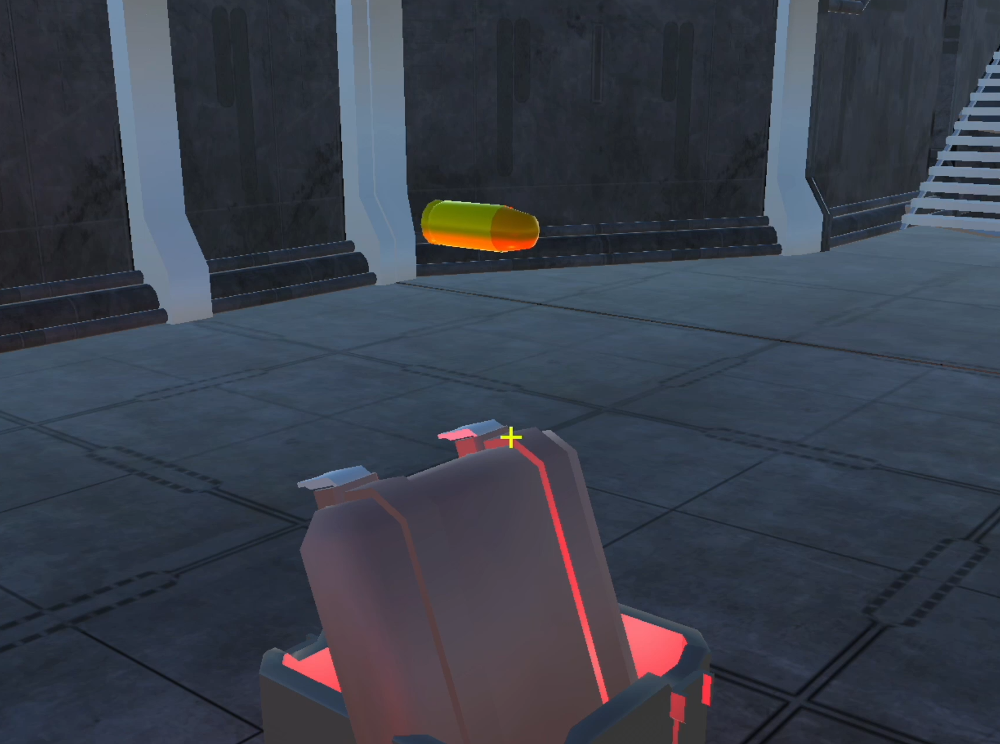
        

<em>Bullet.</em>

Bullets: The bullets will be generated at shoot towards the centre of screen, calculating destination using raycast and fly towards the objects. If it hits the enemy, it will apply damage to the creature with the predetermined level of damage.

Notes (USP) Interaction: The notes can be opened by the player so that they can read it, furthermore,it will provide buff to the game and bring changes to the gameplay. A random event will happened as the player closes the note and changes the game's status (e.g. The player can jump higher, moves faster, enemies are more difficult to kill... etc). More details regarding the design will be explained in objects section.

        
        

<em>Boss Jump Attack.</em>

Boss Range Attack Plate: If the boss jumps and starts a range attack, an object of this attack will be created in center location of boss. If the player is within the range (inside collider of this object), the player's health will be deducted.

        
        

<em>Boss Swipe Attack.</em>

Boss Remote Attack Swipe: If the boss swipes and generates the blade, it will face and fly towards the player. If the blade hits the player, the player's health will be deducted.

        
        

<em>Gun Change.</em>

Pick-up and change rifles: The player is able to change their rifle once during the gameplay. They can choose one option and the gun will be replaced.

### Levels and World Design
#### Game World: 
The game is designed in 3D, and the views change as the player moves because the game is played in first person. The game is multi-stage where the stages are separated by the appearance of the boss. Some glowing effects can be used as instructions to attract player as navigation. For example, crates have a glowing boundary to attract player to approach. The player can explore the map by walking around the structures.

        
        

<em>Lighting Concept.[6]</em>

#### World Design:
The game world is designed and implemented as shown in the following diagram. We intend to create a map that is large enough so that players are able to explore and escape from attacks.

        
        

<em>Floor Design.</em>

#### Objects: 

        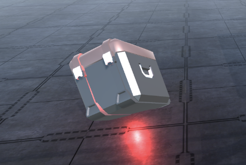
        

  <em>In Game Crate.</em>

Supply crate: Scifi themed, placed randomly within the environment. With a red light contained inside, so that player is able to notice it immediately.

        
        

<em>Game World Placement.</em>

Structures - walls, interior settings, floors, set limitations and plot of the environment. 

        
        

<em>Boss Cage.</em>

Boss Cage: a modern cage that locks the boss until a certain time (2:30) passes.

Enemies (Minotaurs and Boss as shown above) - Their role is to stop the player from staying alive. Matches with the theme biochemical factory that they are invented by the scientists.

        
        

<em>Game View Concept.[7]</em>

        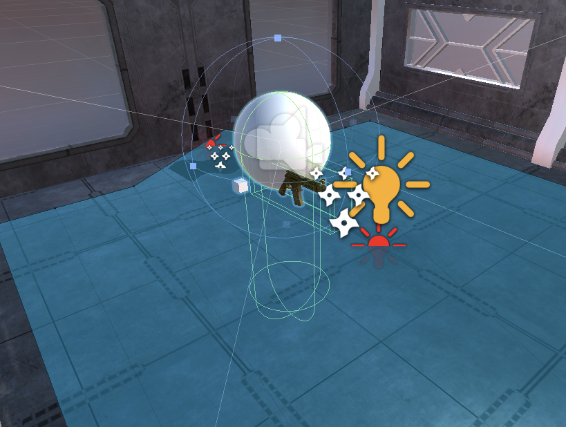
        

<em>Player object.</em>

Player - There is no visual for the players as we are using first person view. This is determined due to the limited scope of the project as well as for disk / memory efficiency measures. There will be a gun model that is attached to the right of the player model.

        
        

  <em>Supplies.</em>

Supplies - Potions and bullets. 

        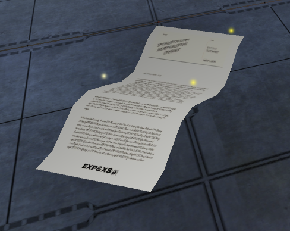
        

<em>Notes.</em>
      

Notes (USP) - The notes can be opened by the player so that they can grow their understanding regarding the background theme of the game, as well as for more interactions to change the gameplay. The brightness of the notes will be higher as player walks closer to it for purpose of notification using shaders. It will also contain a wave effect. To further enhance attractiveness, a particle will be added around the notes.

        
        

<em>Boss Blade.</em>
   
Boss Blade - It is built using particle systems. It has a light-blue color that matches with the boss's left hand. It will be very bright and dynamic. Involving a light to further enhance the brightness.

        
        

<em>Boss Range Plate.</em>
  
Boss Range Attack Plate - It will be built using a compressed sphere, that is a circular plate, to demonstrate the range of the attack. It will move up and disappear when the attack is completed. It contains a blue colour using a shader to further improve the dynamic, that is expanding from a point eventually filling the entire plate of the object, showing a spinning texture.

        
        

<em>Rifles[16].</em>
  

Rifles: the player comes up with an default gold rifle, however they have one chance to switch a rifle when they find and interact with the rifles in the lab area. Each rifle have slightly different parameters in rate of fire, weight (impact player speed), and maximum clip load. We have also optimised the material's colour and metalness, smoothness to create better reflections.

#### Physics: 
Gravity - objects and creatures obey gravity on Earth  
    
Newton’s Law - The player and creatures are able to move around by walking, where gravity is appllied.
    
Physical Damage - The player’s health is deducted when getting hit from hostile creatures.  Similarly, the creatures' health is deducted when bullets hit their body.
    
Smoother starting and stopping effect - Apply dragging forces when player begins and stops to move, brings effect of acceleration and deceleration.
    
Colliders - collider of the enemies is sligthly greater than the mesh model itself to make it not overly difficult for the player to aim the enermies
    
Knockback effect - There's knockback effect when player or monsters are attacked.

Recoil force - A recoil force is also applied when the player shoots.

Player-Enemy Collision - To provide a smooth, uninterrupted and unblocked gaming experience, the player is able to pass through the minotaurs or the boss. This is a optimised decision that is beneficial to the player.

### Art and Audio
#### Art Style: 
The game has a major art style of science fiction, consisting of futuristic illusions as well as experimental imagination, with plots including concise and spacious layout consisting of modern existing elements and surreal creatures. 

        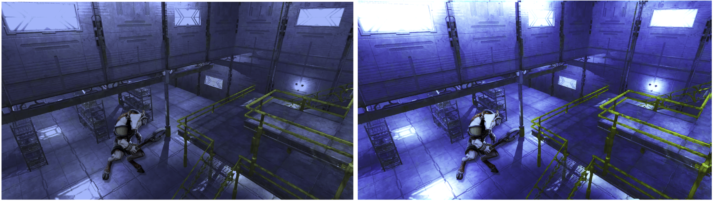
        

<em>Game Style Concept.[3][8]</em>

The overall game has a cold tone graphics that maintains bluish tint, aiming to construct an environment with an atmosphere of callous and ruthless. We achieve this by using many white light sources, regular rectangular shapes as walls, and reflective smooth textures for futurism.

The setting of the game has a strong scientific background, with micro plot in biomedical factories and computer laboratories from the macro perspective. Hence the textures (building blocks) we are using here allow us to construct an unique structure for gamers to explore.

The overall aesthetic has a constitution of futuristism and surrealism with illusion from biochemistry and science. Some relative art styles or concepts are _Cyberpunk 2077_ , _Doom Eternal_.

        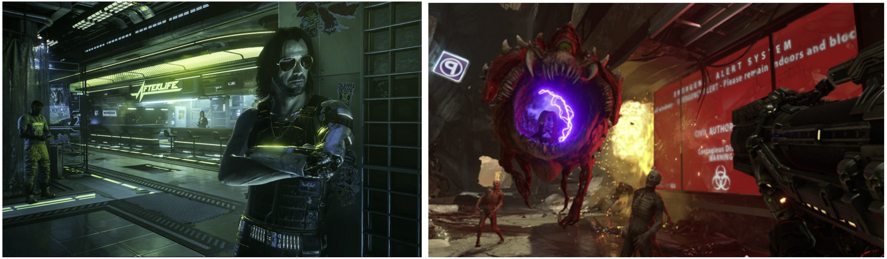
        

<em>Cyberpunk 2077, Doom Eternal.[9][10]</em>
       

#### Sound and Music: 
The sound design includes sound effects and background music.

        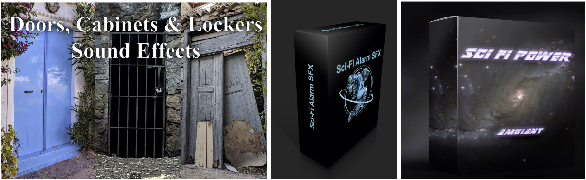
        

<em>Sounds.[11][12][13][14][15]</em>
  

There are multiple sound effects in this game.
* Security alarm when boss is getting released from cage.
* Playing being attacked.
* reloading and shooting bullets.
* Sound when players is walking.
* Various sounds when minotaurs attack the player.

The ambient Sci-Fi background music begins after the game is started and in progress, it serves as an auxiliary of the aesthetic design of the scenes, providing the gamers a sense of strangeness and insecurity, an immersive gaming experience overall.

In settings menu, there will be a sound effect of a notification when player changes the sound level of the game to notify the player of current sound level.

In the main menu and lose or winning interfaces, there will be another background music that creates tense, exhibiting as an introductory music towards the scientific and mystery theme of the gameplay to be started. Reflecting the theme of experiments. Enhancing user's understand on context.

There will also be a credits scene with a music that sounds more brighter, which serves as an outro when the player wants to know more about the development team after playing the game contents.

#### Assets: 
The candidate assets are free assets that we have already sourced from unity asset store, each for different objects, scenes.

Asset 1: Major Scene for combat / gameplay

        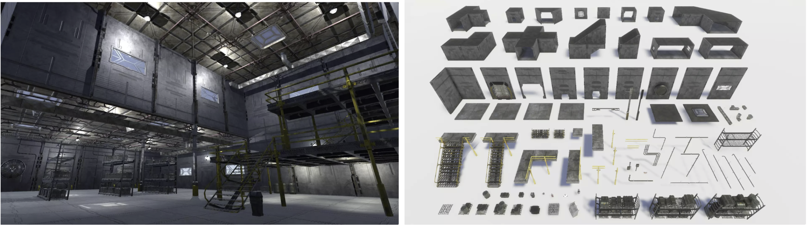
        

  <em>biochemical factory.[8]</em>

Asset 2: Monsters and enemies

        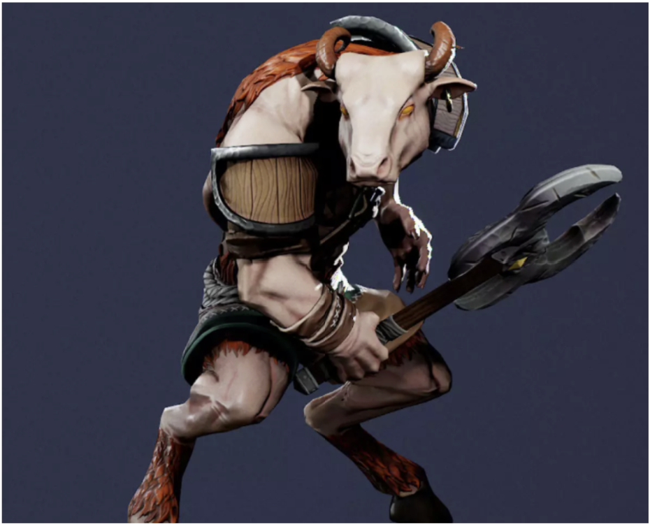
        

    
<em>minotaur.[3]</em>

        
        

  <em>Boss.[4]</em>

Asset 3: gun

        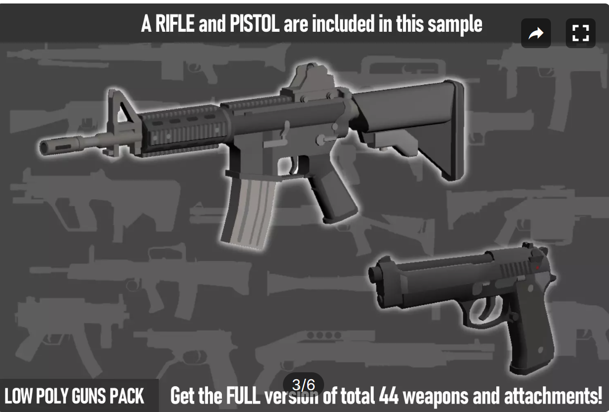
        

  <em>Gun Pack.[16]</em>

Asset 4: Obtainable Items (Power-up)

        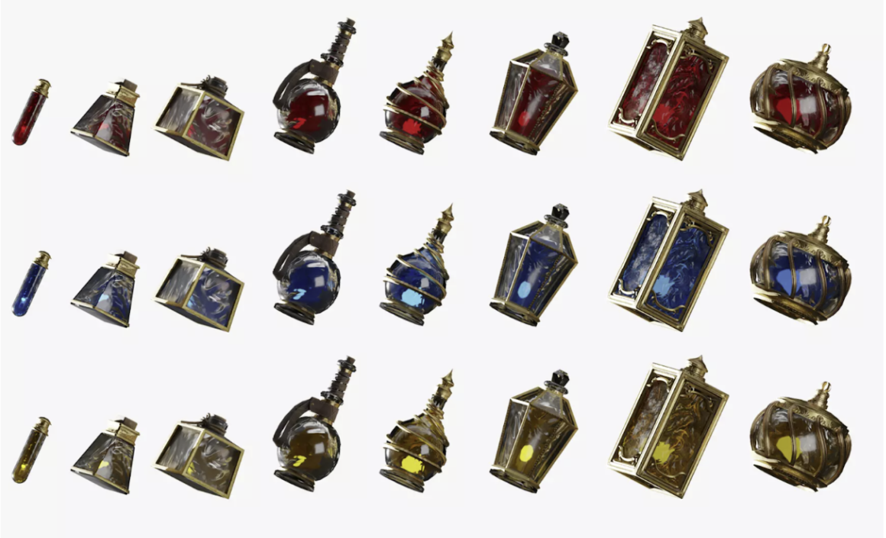
        

  <em>Obtainable Items[17]</em>

Asset 5: Crates (to provide obtainable items)

        
        

  <em>Scifi Crates.[18]</em>

### User Interface (UI)
#### Menu UI:

        
        

  <em>Menu UI Design.</em>

        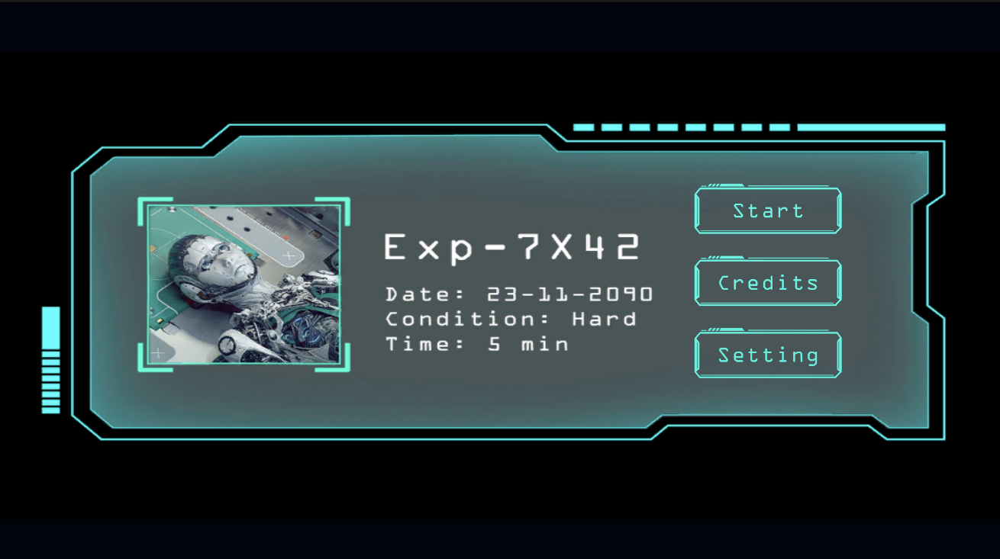
        

  <em>Actual Menu UI Design[19].</em>

The design of the menu UI intends to simulate a control panel on the wall of the scientific (computer) laboratory, with the wall graphics / textures showing behind the selections. This unites the UI layout together with the game background, that is we start the game as we start the scientific experiments.

The options available in the menu are: start, settings and credits.

Since there is no exit function available due to WebGL game environment, in the actual design we have replaced the exit button to credits button.

Clicking the credits button will display credits to developers.

#### Settings UI:

        
        

  <em>Settings UI Design.</em>

        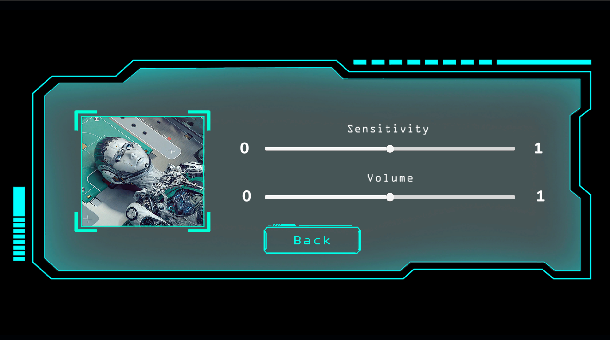
        

  <em>Actual Settings UI.</em>

Again, following the same concept, the settings UI forms by similar shapes but different colours since we are on a different page. The music and sound volume rocks also act as a form of control panel, retaining the same game aesthetic design.

There are two metrics to be optimised, which is sensitivity and sound level.

Since we have optimised all of the sound effects and music in a harmonic standard relative to each of its sound level, the user could simply adjust level of all audio at the same time to gain the best experience.

The sensitivity control we've add is major due to under WebGL development, different computers with different display resolutions will provide drastically different sensitivity level by default. Hence users may want to adjust the levels by themselves for their own experience.

#### GamePlay UI:

        
        

  <em>Gameplay UI Design.</em>

        
        

  <em>Actual Gameplay UI.</em>

Left-bottom: 
  * health bar

Left: items with a quantity next to the icon
  * Healing Potion
  * Accelerating Potion
  * Greater Bullet Harm Potion

Right-bottom:
  * Bullets and current clip load
    
Right-up:
  * timer of time left to survive

Typical first-person shooting game UI aesthetic design. The layout is very straight-forward, clean and easy to use, especially for game controls using keyboard and mouse.

#### Notes UI:

        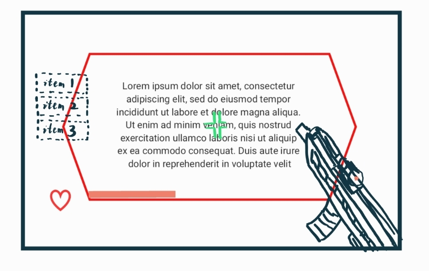
        

  <em>Notes UI Design.</em>

        
        

  <em>Actual Notes UI.</em>

The notes UI involves displaying a transparent scroll block in the middle of the screen on top of the gameplay ui, while the player is playing the game. It is set to be transparent it won't block the player's view of the scene.

When the user closes the window, the effect of USP will be displayed under health bar for a limited time.

The player is able to scroll using the mouse to real all of the story notes message.

#### Pause UI:

        
        

  <em>Pause UI Design.</em>

        
        

  <em>Actual Pause UI.</em>

The pause UI involves different shapes as in the plot, we are in the inner layer of the plot (virtual world).

The red colour is to imitate the imagination of the main character (player) in their own mind, so the background will be the current paused gameplay but darkened.

The two options are resume and quit. At any time during the game, players can use Esc to switch between pause and resume.

#### Win / Lose UI:

When the player loses or win the game, the corresponding UI will POP-UP. 

        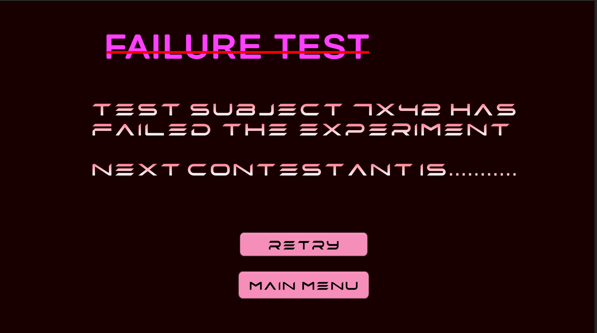
        

  <em>Lose UI.</em>

Colour theme of the Lose UI will be pink and red, representing that the test conducted is in a failed status. It provides some story letting the player know the outcome.

        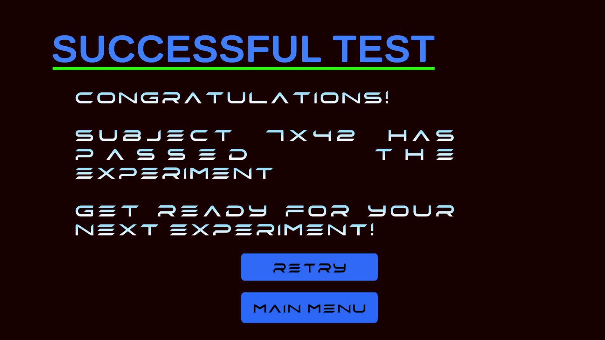
        

  <em>Winning UI.</em>

Similarly colour theme of Winning the game will be blue, indicating a successful result. Providing some story for player to understand.

Both of the interfaces will provide two buttons for player, return to main menu or retry the game.

#### Credits UI:

        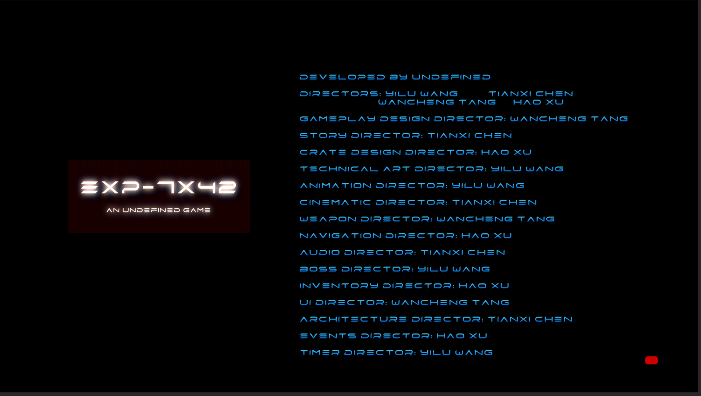
        

  <em>Credits UI.</em>

Showing a rolling texts presenting the contributions of the development team. With a logo of the game on left.

The red button is a button that allows user to return to main menu.

#### Story & Instructions UI:

        
        

  <em>Story UI.</em>

Following start of the game, the user should be able to view a seamless transition, introducing the background of the game and the purpose to survive fir 5 minutes. There is a continue button so the user may continues without reading. This scene simulates the computer coding environment, enhancing the background of game.

        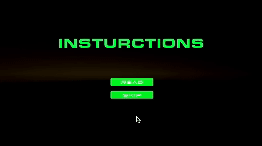
        

  <em>Instructions and pre-begin UI.</em>

Then the instruction scenes provide users tutorial on basic controls of the game. The user can either skip or read through.

There is only one buttion in each page which "next" and "continue" for the last page.

After either skipping or read through the instruction, the game shows a scene telling players that the simulated enviornment begins to load, the users can click start to begin their journey!

### Technology and Tools
* Unity - development of WebGL game
* GitHub - work collaboratively on the project 
* GitHub desktop - project management 
* Photoshop - create 2D icons, UI design
* Miro whiteboard - visualise game interface 
* Adobe audition - editing of music and sound effects
* Mixamo - character and animation model
* Trello - progress & workflow management
* Monday - Timeline Gantt Chart Drawer
* Canva - UI and layout design

### Team Communication, Timelines and Task Assignment
Main Communication channel: WeChat
We host meetings every week or twice a week to ensure the development is always in progress and everyone is on the same page.

        
        

  <em>Game DEV Timeline.</em>

The Monday board of the timeline can be found here:

[Monday.com Timeline](https://view.monday.com/1819003647-cb526f05450daee542a0e95510d56c44?r=apse2)

The specific role allocation to tasks can be found here:

[Monday.com board](https://view.monday.com/1819003647-29567d209672bf574768c0364d97a984?r=apse2)

Update: the board is no longer editable due to end of trial period for Monday boards

Here is a summary of high-level role allocations

|  | Yilu Wang | Wancheng Tang | Tianxi Chen | Hao Xu |
|---|---|---|---|---|
|GDD| Game overview Timelines and Task Assignment   | Gameplay and Mechanics | Art and Audio User interface | Story and Narrative Levels and World Design |
|Prototype| Enemies animation   Boss animation  | Player gun model and animation Camera  | Game world (a small one) | Supply crate opening animation Resources models (bullet, healing potion) |
|Game DEV| Boss Animation & timer management | Game UI (scenes) | Game World | Crate Instantiate & AI Nav |
|Game DEV| Enemy Generator & BG | Game UI (connect with backend) |  boss particle effects / notes / shaders | AI Nav (continue) / particles explosion 

    

### Possible Challenges
* Achieve a high standard on visual stimulation so that the audience can have the experiences that they suppose to have 
* Need to create a world that is big enough so the player can have the opportunity to explore 
* Making animation for the boss attacking player  
* Uniform artistic style of all elements in the scene
* Interior design for the game world can be massive
* Compress textures to make it within the limit

### References
[1] https://noteofnaught.tumblr.com/post/655515199904808960/%E4%BD%86%E4%B8%81%E5%AE%B6%E9%87%8C%E7%9A%84%E7%BA%B8%E6%9D%A1%E4%B8%8E%E4%BF%A1-notes-and-letters-from-dantes-house

[2] https://pro.psycom.net/news-research/deep-brain-stimulation-shows-potential-for-treatment-resistant-schizophrenia

[3] https://assetstore.unity.com/packages/3d/characters/minotaur1-196863

[4] https://www.mixamo.com/#/?page=1&type=Character

[5] https://en.wikipedia.org/wiki/File:Stalkershot_2.jpg

[6] https://www.nationhive.com/en/games/hogwarts-legacy/guide/room-requirement

[7] https://i.ytimg.com/vi/CF7n4Piqpvs/maxresdefault.jpg

[8] https://assetstore.unity.com/packages/3d/environments/sci-fi/sci-fi-construction-kit-modular-159280

[9] https://www.xbox.com/en-US/games/cyberpunk-2077

[10] https://store.steampowered.com/app/782330/DOOM_Eternal/

[11] https://assetstore.unity.com/packages/audio/ambient/sci-fi/sci-fi-alarm-sfx-238043

[12] https://assetstore.unity.com/packages/audio/sound-fx/classic-footstep-sfx-173668

[13] https://assetstore.unity.com/packages/audio/sound-fx/sci-fi-guns-sfx-pack-181144

[14] https://assetstore.unity.com/packages/audio/sound-fx/foley/door-cabinets-lockers-free-257610

[15] https://assetstore.unity.com/packages/audio/ambient/sci-fi/sci-fi-ambiant-power-174139

[16] https://assetstore.unity.com/packages/3d/props/guns/sample-low-poly-guns-pack-207957

[17] https://assetstore.unity.com/packages/3d/props/food/health-potion-bottle-set-204920

[18] https://assetstore.unity.com/packages/3d/nextgen-sci-fi-crate-45877

[19] https://www.bing.com/images/search?view=detailV2&ccid=t6XVmwuM&id=9D4B3E61164A11736FC3076C6A38A4482B30626D&thid=OIP.t6XVmwuM1vmTmpz11ktvjwHaEK&mediaurl=https%3a%2f%2fimages3.alphacoders.com%2f109%2f1092510.jpg&exph=2160&expw=3840&q=robot+in+scifi+experiment&simid=608045362569430795&FORM=IRPRST&ck=98606F7DB3EED41FC3BF13BF66F9B35D&selectedIndex=24&ajaxhist=0&ajaxserp=0
