# Game Report

Read the [project 2
specification](https://github.com/COMP30019/Project-2-Specification) for
details on what needs to be covered here. You may modify this template as you see fit, but please
keep the same general structure and headings.

Remember that you must also continue to maintain the Game Design Document (GDD)
in the `GDD.md` file (as discussed in the specification). We've provided a
placeholder for it [here](GDD.md).

## Table of Contents

* [1. Evaluation Plan](#1-evaluation-plan)
  * [1.1. Evaluation Techniques](#11-evaluation-techniques)
  * [1.2. Participants](#12-participants)
  * [1.3. Data collection](#13-data-collection)
  * [1.4. Data Analysis](#14-data-analysis)
  * [1.5. Timeline](#15-timeline)
  * [1.6. Responsibilities](#16-responsibilities)
* [2. Evaluation Report](#2-evaluation-report)
  * [2.1. Participant Background Summary](21-participant-background-summary)
  * [2.2. Raw Data](#22-raw-data)
  * [2.3. Analysis: Post-task Walkthrough](#23-analysis-post-task-walkthrough)
  * [2.4. Analysis: Interview](#24-analysis-interview)
* [3. Shaders and Special Effects](#3-shaders-and-special-effects)
  * [3.1. Shader - Lore Notes](#31-shader---lore-notes)
  * [3.2. Shader - Boss Jump Attack](#32-shader---boss-jump-attack)
  * [3.3. Particle System - Boss Swipe Attack](#33-particle-system---boss-swipe-attack)
* [4. Summary of Contributions](#4-summary-of-contributions)
* [5. References and External Resources](#5-references-and-external-resources)


## 1. Evaluation Plan
### 1.1. Evaluation Techniques
#### 1.1.1. Observational Method: Post-task Walkthroughs 
##### Advantage of the technique
The game is designed to be quite intense, so it may cause some disruptions that affect user experience if the participants were asked to explain their thoughts. In this case, Post-task Walkthroughs will be advantageous compared to Think Aloud and Cooperative Evaluation, because it allows the participants to be immersed in the game without the need to talk while playing. Furthermore, the participants can explain their thinking more clearly and accurately after the game compared to when they are trying to survive intensive enemy attacks, which can make the user feedback collection process easier. From the recording of the participants playing the game, we can also generate more detailed information (e.g. number of enemies killed, number of potions used, etc.) when we look back at the recording. 

##### The participants’ role
The participants need to record their screens from the start of the game until the end (either win or loss), including the noises they make (but they are not forced to make any). This allows for a complete understanding of what they did, including at the starting page and during the ending scene. They are allowed to play the game multiple times if they would like to. 

Afterward, preferably right after they finish the game, we will have a conversation with them and watch their recordings with them. They would need to explain their thoughts during the game, including the reason behind the choices they made, their feelings when an event happened, their experiences performing the functions within the game, etc. 

##### The participants’ tasks in the game 
The game is designed to have some degree of freedom for players. Players can choose to do whatever they want to (e.g. shoot enemy or escape from the enemy, pick up lore notes, etc.).

However, we do want all participants to perform the basic functionalities in the game, including: 
* Kill at least one enemy 
* Open at least one crate
* Use at least one potion
* Pick up at least one lore note
* Going up the stairs
* Jump
* Survive as long as they can
* Win at least once 

Other than the above, the participants will also be required to lose once to provide feedback on the failed scene from the game. 

#### 1.1.2. Querying Technique: Interview 
##### Advantages of the technique
Compared to questionnaires that use the same questions for all participants, interviews can focus more specifically on each individual's experiences rather than being too broad. Interviews can include objective and quantitative questions that questionnaires are good at, meanwhile it is also suitable for subjective open-ended questions that provide us with different aspects that participants focus on. Follow-up questions allow for more personalized questions that can give us more insightful feedback, which can be extremely helpful for us to make high-quality improvements. 

##### The participants’ role
Interviews can be done within 24 hours of them finishing with the game. The interview will be divided into two parts:
1. Quick rating questions on the overall experiences;
2. Open questions on the good aspects and problems that the participants identified during the game. 

At the end of the interview, we will be filling up the table below: 

|  |  | Rating (1-10) | Commend | Problem | Suggestion | 
|---|---|---|---|---|---|
| Player Control | The comfortability of using keyboard control for shooting, movement, picking up and using items
|                | The smoothness of using the mouse to make the camera rotation
|                | The experience with the shooting mechanics in the game (including the animation, frequency, and capacity of ammunition)
| Minotaur & Boss | The suitability of enemy harm
|                 | The distribution and quantity of enemy
|                 | The interaction between the enemy and the player
|                 | The representation and appearance of the boss and its cages
| Crate & Items | The distribution and quantity of crates
|               | The strength of the crate items
|               | The diversity of crate items
| Lore mechanics impact (USP) | The extent to which the lore mechanics increase the entertainment value of the game
|                             | The extent to which the lore is nicely integrated into the game 
| Visual effect & UI | The arrangement of the health bar, item menu, number and capacity of bullets
|                    | The instructions are clear and noticeable
|                    | The extent to which the starting page and the ending page match the game
|                    | The aesthetic quality of the visual effects in the game (e.g. shooting, bleeding, healing, speeding up, attacks of the boss)
|                    | The aesthetic quality of the text in the game (e.g. timer, instructions on keyboard controls, text of the lores）
| Audio effect | The extent to which the background music fits the game 
|              | The suitability of the sound effect (e.g. the player moving, the enemy roaring, opening crates, using crate items)
| Game Physics | The extent of the game physics matching your common sense 
| Other | Overall 
|       | (new topics coming out during the interview)

<p align="center">
  <em>Table 1. Interview feedback table.</em>
</p>

This table is a guide for result collections, but follow-up questions relating to new topics that are not shown in the table can be possible if we find their thoughts worth elaboration. We also aim to keep the conversation natural instead of being forced to go to the next thread on purpose. 

### 1.2. Participants
#### 1.2.1. Participants background
Our target participants will be teenagers within the age range of 18-30. 

The participants must have some experience with PC games (i.e. playing games involving using mouse and keyboard) and best to have an interest in the theme of science fiction or adventure, as this is our target audience portrait. 

We will purposefully include participants with a variety of understanding and experience in FPS gaming, including people who have never played FPS games before to people who play FPS games on a daily basis. Most of the participants would be players who have at least some experience with FPS games. 

By having participants from a variety of gaming backgrounds, we can ensure that we obtain informative evaluations from different ranges of perspectives. 

#### 1.2.2. Recruitment process 
Most of the participants will be recruited from our classmates and friendship groups. We will also include some participants from gamer group chats (on WeChat and Discord) who are experienced in gaming to make sure their evaluations are specific and professional and can hit the point of our game.

In addition, we will invite our families as participants. Although they might not be in the targeted age group, they could be more willing to spend time on our game and give more patience in suggestions.

We will ensure the participants can perform the tasks within a certain time frame - including completing game playing, followed by the evaluation tasks (i.e. post-task walkthrough or interview) under our planned evaluation strategy and criteria.

### 1.3. Data collection
#### 1.3.1. Observational Method: Post-task Walkthrough 
##### Types of Data and Method to collect them
During the walkthrough where the participants talk about their thoughts during the game, we will note the important part using a notepad, while recording the conversations as an audio recording for future reference. 

From the gaming video recorded, we will also collect some quantitive game data that reflects the actions and performance of the participants during the game (e.g. number of enemies killed). We will also note any bugs that we discover from the recording and later summarize them into a to-do list to fix. 

##### Tools used to collect data
Built-in video capture software on computers might be used by the participants. 

Recordings will be done using phone or via Zoom depending on the nature of the meeting location. 

Results will be noted using a shared Google Doc to facilitate information transparency within the team.

#### 1.3.2. Querying Method: Interview 
##### Types of Data and Method to collect them
Interviews will focus on collecting verbal data through communication. The interviews will be recorded for future reference as an audio recording. 

We collect the player’s feedback based on the questions we prepared, and there would also be some extensions generated through the conversation. The collected feedback will be integrated into the table shown in Section 1.1.2 (see Table 1 above). 

##### Tools used to collect data
Recordings will be done using phone or via Zoom depending on the nature of the meeting location. 

Qualitative data are stored in a table (see Table 1 in Section 1.1.2) in a shared Excel sheet. 

Other interesting points will be noted using a shared Google Doc to facilitate information transparency within the team.

### 1.4. Data Analysis
#### 1.4.1. Post task walkthrough
From the quantitative data that can be collected using the game-playing recording, we will generate the following **graphs**: 
| Types of graph | Data represented | Analysis | 
|-|-|-|
| Scatter plot | <ul><li>Horizontal axis = the number of potions received by each parcipant</li> <li>Vertical axis = the number of potions used by each parcipant</li> <li>Each type of potion represented by one graph</li> <li>Use a dotted line to represent our expected number of potions used (i.e. we expect the players to use all the potions they get, so the trend should be y=x)</li></ul> | Use percentage of potions used out of the potions received together with our expectation value to determine whether we are putting too much potion or not enough potions
| Scatter plot | <ul><li>Horizontal axis = the number of bullets owned</li> <li>Vertical axis = the number of bullets used</li> <li>Use a horizontal dotted line to show the initial number of bullets the player has</li></ul> | 1) Check if the participants used at least the initial amount of bullets, if not, the initial amount is too high; 2) Check if the participants used most of the bullets they owned after collecting bullets from crates (i.e. around 80%), if not, there are too many bullets in the crates.
| Bar graph | <ul><li>Horizontal axis = different participants</li> <li>Vertical axis (left) = total number of enemies killed by each participant</li> <li>Vertical axis (right) = number of bullets used</li></ul> | The number of bullets used compared against enemies killed indicates the "bullet efficiency", defined as the average number of bullets needed to kill an enemy. An acceptable range is between 25 and 35 bullet per enemy (enemy can be killed by 25 bullets), suggesting that players have not wasted too many bullets without getting a kill to increase chance of survival.
| Pie chart | <ul><li>Showing the minimum health of the participants (i.e. 0-10, 10-20, 20-30, ..., 80-90, 90-100).</li></ul> | By knowing the minimum health, we can decide whether the difficulty is suitable, thus changing the setting of the game (e.g. the proportion of negative buff from lore). The expected minimum health reached is between 30% and 70%. This means the game will propose some difficulty even for skilled players, but also not too difficult that players new to FPS will easily die. 

<p align="center">
  <em>Table 2. Data analysis graphs.</em>
</p>

There will also be a **written report** on the possible improvements and/or bugs identified during the walkthrough or via the game-playing recording. 

#### 1.4.2. Interview
We will use the rating for each of the big areas of the game to form a **pie chart**, so that we can visualize the proportion of dissatisfaction on each aspect of the game, thus determining the priority of the problems we need to solve (e.g. if the lore mechanism takes the most proportion of dissatisfaction, then we focus on solving problems of lore first, and then the second topic with most dissatisfaction in the interest of time).

Example: 
<p align="center">
        
        </p>
<p align="center">
  <em>Figure 1. Sample pie chart.</em>
</p>

There will also be a **written report** based on the qualitative data, summarizing the important points about the possible improvement that the participants offer on the aspects that they are not satisfied with. Based on their response to the interviewing questions, we will also add our own thoughts on the improvement strategies as well. 

### 1.5. Timeline
https://view.monday.com/1818674093-0104d9dcc80b375c475ca7c7e23af11f?r=apse2

<p align="center">
        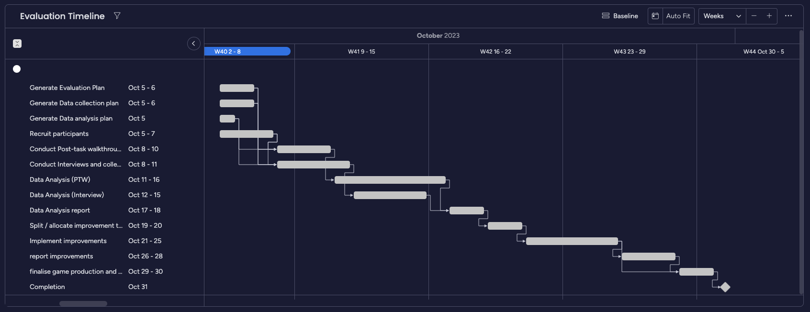
        </p>
<p align="center">
  <em>Figure 2. Evaluation timeline.</em>
</p>

### 1.6. Responsibilities

| Task | Members |
|-|-|
| Plan - Evaluation Techniques             | Yilu Wang, Hao Xu 
| Plan - Participants                      | Tianxi Chen, Yilu Wang 
| Plan - Data Collection Plan              | Hao Xu, Yilu Wang
| Plan - Data Analysis                     | Yilu Wang, Wancheng Tang, Tianxi Chen
| Conduct Post-task walkthrough            | Hao Xu (2 participants), Wancheng Tang (1 participant), Tianxi Chen (2 participants)
| Conduct Interview                        | Yilu Wang (4 participants), Wancheng Tang (1 participant)
| Data Analysis: Post-task Walkthrough     | Wancheng Tang
| Data Analysis: Interview                 | Yilu Wang 
| Diagrams                                 | Hao Xu
| Shader & Particle System Analysis        | Tianxi Chen 
| Game development (improvements)          | All (to be split further after we received the result) 
| Finalise production and review checklist | All
| Gameplay video                           | Tianxi Chen 

<p align="center">
  <em>Table 3. Group member responsibilities.</em>
</p>

We have allocated each task to team members based on equal estimation of length, to ensure that each team member contributes equally. The type of responsibility that each member is assigned to is also based on their capability. The members who have a wide friendship group are assigned to find more participants; the members who can do post-editing are assigned the task of making the gameplay video.  

To further enhance fairness and address potential teamwork issues, we will have meetings at least 1-2 times a week at the end of each stage (e.g. after data collection) for a collaborative environment where we share our thoughts and help out on the challenges that others are facing. We constantly check the progress of each team member in our group chat and discuss topics together for further actions during each meeting. 


## 2. Evaluation Report

### 2.1. Participant Background Summary
All our participants are between the age of 18-30. The observational method (post-task walkthrough) and querying technique (interview) have 5 participants each, with various experiences in FPS. This matches perfectly with the target audience of the game. 

| Experiences with FPS | Number of Participants (Post-task Walkthrough) | Number of Participants (Interview) |
|-|-|-|
| Has never played FPS but played other PC games | 1 | 1 |
| The last time playing FPS was before 12 months | 1 | 1 |
| Play FPS on a monthly basis                    | 3 | 2 |
| Play FPS on a weekly basis                     | 0 | 1 |

<p align="center">
  <em>Table 4. Participants' experience with FPS.</em>
</p>

### 2.2. Raw Data 
(To see our raw data, please use the University of Melbourn email to access the following link: https://docs.google.com/spreadsheets/d/1-lcbA4ZNe1Zs1rdXUYZSg7XvZR-qJ_GpZx8wRG9f0PI/edit?pli=1#gid=0) 


### 2.3. Analysis: Post-task Walkthrough
To evaluate the information collected data from the Post-task Walkthrough and identify potential improvement, we followed these steps
1.	The participants were asked to rewatch the video of their game play, with special attention given to their allocation of resources (i.e., why they used it or why they didn’t). Noteworthy responses are recorded.
2.	The following data are recorded for each participant’s gameplay to be used in quantitative analysis
    1.	The total number of each kind of potions collected, along with the number of each kind used
    2.	The total number of bullets (initial + collected) throughout the game, along with the number of bullets used
    3.	The lowest health reached throughout the game
    4.	The number of enemies killed
3.	The results from step 2, along with the expectations of each value determined in evaluation plan, were used to generate 5 graphs and 1 chart (as shown in Figure 3, 5, 6, 7). 
4.	The visual representations from step 3 are further analysed to assess game difficulty, strength of resources and how well players understand the resources’ uses. Focus is given to the mismatch between expectation determined prior and the actual data, which likely indicates a problem in game design.
5.	Problems identified from step 4 are combined with participant responses in the walkthrough to determine practical improvement areas. 


#### 2.3.1. Analysis on potion usage
##### Graphs
<p align="center">
        
        
        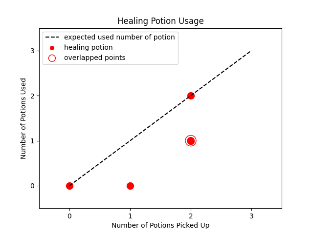
        </p>
<p align="center">
  <em>Figure 3. Scatterplot reflecting the number of potions used vs number of potions collected.</em>
</p>


##### Problem identified
As outlined in the evaluation plan, players are expected to use all potions collected since they can benefit the player at any point in game, and wasting this resource is discouraged.

The graphs show the expected potion usage with a dotted line at y = x (expected same number of potions picked up and used). Any dot below this line represents a player who had unused potions at the end of the game.

Such points are present in the graphs for all three types of potions. During the walkthrough, the primary reason given by participants was that they were unawere of the effect of potion, since there was no description of the objects. This leads to them perceiving the potions as useless and ultimately wasting the benefits.  

##### Solution
Originally, the effect of potion was never specified in game because we did not want player to view too much information during gameplay, which can distract them from shooting. However, the problem of them being confused about helpful resources is more serious, so we decided to implement a new scene containing a short tutorial prior to starting the game. This way the player can be more knowledgeable about the resources in hand before engaging in gameplay and can make informed decisions on how to use these resources strategically. 

The new scene is as following:
<p align="center">
        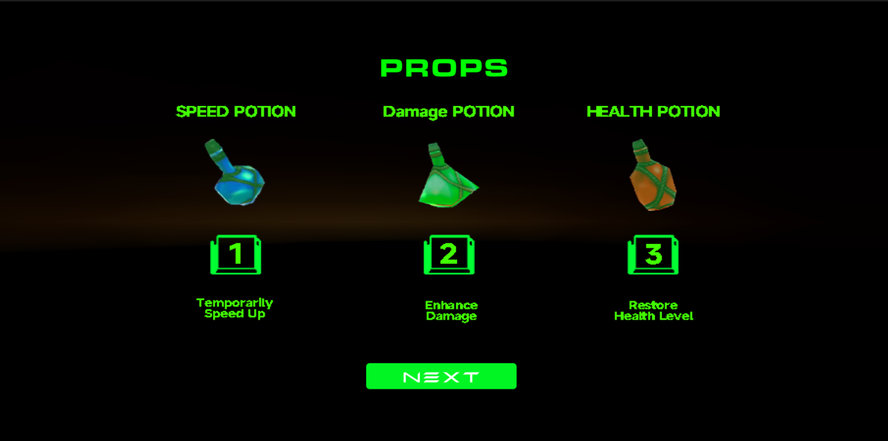
        </p>
<p align="center">
  <em>Figure 4. Improved scene of tutorial of potions.</em>
</p>


#### 2.3.2. Analysis on bullet usage

##### Graph
<p align="center">
        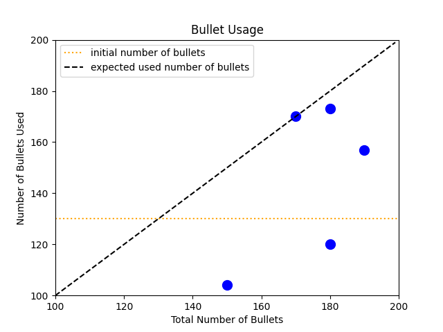
        </p>
<p align="center">
  <em>Figure 5. Scatterplot of number of bullets used vs total number of bullets.</em>
</p>

##### Problem identified
From the quantitative data, the percentage of bullets used ranges from 66% to 100%, with an average percentage of 82.9% and a median around the same value. This matches our expectation during the planning stage. However, it is also noticed that two players used below 130 bullets in total, that is, below the initial value of bullets. We believe this proposes a flaw in design because this leaves the extra bullets from crates potentially useless. As a result, players may lose the incentive to open crates if they think the bullets are more than enough. 

Upon discussion with these two players in the walkthrough, feedback was given that the shooting speed felt too slow. Consequently, they were not using the bullets at a high rate.  

##### Solution
In response, an improvement is made to **decrease the shooting interval** from 0.50s to 0.25s. This makes bullets more valuable as it runs out more quickly, and encourages players to explore the game and look for more crates.

Another improvement implemented is to **decrease the initial number of bullets, while increasing the number of bullets in each create**. Initial bullets are reduced from 130 to 50, while crate bullets are increased from 10 to 25. This makes the crates more valuable and attractive to players. Additionally, initial bullets run out more quickly, forcing players to actively look for crates. 


#### 2.3.3. Analysis on shooting efficiency

##### Graph
<p align="center">
        
        </p>
<p align="center">
  <em>Figure 6. Bar graph of bullet used vs enemies killed for each player.</em>
</p>

##### Problem identified
The shooting performance is an important indicator of the difficulty of the shooting aspect of game. Bullet efficiency is defined as the average number of bulleted needed to kill an enemy. In the data collected, 3 players' statistics fall outside the acceptable range of between 25 and 35 bullets per enemy. 

After reviewing their gameplay, it is noticed that their aim is good, but the enemies take too many bullets to kill. In midst of shooting, enemy gradually approaches players and start attacking, players are forced to run away and leave the enemy alive to avoid damage. This leaves a lot of bullet resources wasted without actually aiding the survival aim. 

##### Solution
The solution for the problem focuses on reducing the length of time needed to kill an enemy, so that player can finish the kill before engaging in other actions. The improvements consists of:
1. Boosting shooting speed, as discussed before in solution part of section 2.3.2. Analysis on bullet usage.
2. Reduce the health of enemies making them easier to defeat.

Another improvement made taking a different approach is to increase the harm of enemy, so that enemies propose a greater threat to players. Leaving one enemy alive after already investing resources becomes less acceptable than before, encouraging players to prioritize completing the kill even when at risk of taking damage.

#### 2.3.4. Analysis on minimum health

##### Chart
<p align="center">
        
        </p>
<p align="center">
  <em>Figure 7. Pie chart of the minimum health reached by players throughout game.</em>
</p>

##### Problem identified
The minimum health serves as an important indicator of the difficulty of the survival challenge. In the evaluation plan, an approapriate range is set to be between 30% and 70%, accounting for variation of skills. However, collected data shows that 40% of participants lost 20-30% of their health and 60% lost only 10-20%. This leaves all participants' minimum health higher than the acceptable range, so the survival mechanism in current design is too easy. 

Upon speaking with participants, it became evident that avoiding damage is too simple. The attack animations of enemies take too long. After an enemy sights a player, it had to approach, stand still, go through a lengthy attack animation, then the damage would take place. If player moves during attack motion, damage can be dodged easily. This incentivized players to flee rather than engage in fight, which contradicts the nature of the game as a shooting game.

##### Solution
To increase the difficulty of survival, **Enemy attack is accelerated**. As stated in the problem section above, originally player can completely avoid damage by continuously running. In the new version, when the enemy stands close to player and initiates an attack, the player will receive exactly one hit if player is running at normal speed. This encourages player to fight enemy before it comes close, or use speed potions to run at a speed that can avoid damage. It also becomes more difficult to survive because the player is almost guaranteed to suffer a hit when being cornered by enemies from multiple directions.


### 2.4. Analysis: Interview 
To analyze the data from the interview and identify potential improvements, we followed these steps: 
1. The participants were asked to give a rating from 0-10 for each criterion we set
2. The sums of the points deducted (from 10) for each criterion were calculated
3. The results from step 2 were used to generate a pie chart (as shown in Figure 8 below), which shows the proportion of the points deducted from each criterion out of all points deducted across all 5 participants
4. Focus on the improvements of the areas that most points were deducted from (i.e. the areas that occupy a larger proportion of the pie chart)
5. Determine practical improvement methods based on the interview responses from the participants about why they are dissatisfied with the areas and our own understanding and thinking of the game 

<p align="center">
        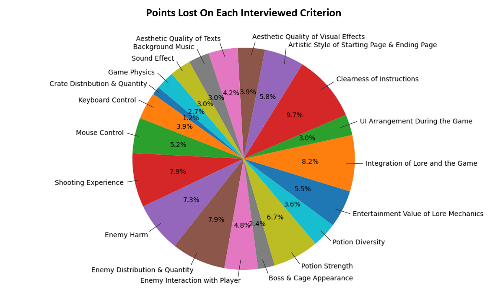
        </p>
<p align="center">
  <em>Figure 8. Pie chart reflecting points lost on each interview criterion.</em>
</p>


#### 2.4.1. Communication of Instructions 

##### Problem identified  
The criterion *Clearness of Instruction* (9.7% of the points lost) occupies the largest space on the pie chart, which implies there is a huge problem with the way we communicate instructions to the player. There are two major reasons that caused this problem. 

Firstly, **the aim and background of the game are not clear enough, some participants didn't realize that the winning condition is to survive for 5 minutes**. Although the participants saw the timer, they didn't understand that the timer was supposed to be a countdown of the time they needed to stay alive to win. The lack of background understanding also caused points deducted from other criteria - they voted down on  *Artistic Style of Starting Page & Ending Page* (5.8% of the points lost) because they think the starting and ending page has a sci-fi style but the Minotaur is from the medieval, so their artistic style does not match the game; they voted down on *Integration of Lore and the Game* (8.2% of points lost) and *Entertainment Value of the Lore Mechanics* (5.5% of the points lost) because they didn't know the lore notes has background story nor realized that it has some effects on the game. 

Secondly, **the instructions are not clear nor readable to the players so they cannot understand how to play the game**. The font we used for the texts was quite fancy, and the duration of the texts appearing on the screen was too short for the participants to properly read them. Therefore, most of the participants guessed the way to perform certain actions based on their knowledge of PFS. Since our game also targets the group of people who have not played much FPS, this is something we need to improve on.  

##### Solution 
Originally, we purposefully made the background story vague and fuzzy to make the players more curious about the background story, so they are more interested in looking at the lore notes. However, it turns out that players do not want to spend time on a story that they previously knew nothing about in a 5-minutes game. Therefore we changed our strategy to making the background story super clear at the start of the game before the player enters the game, so the players are more familiar with the game and thus get a better user experience. 

A new scene is added after the players click "start" and before the players enter the game. This scene includes: 
* An explicit textual explanation of the background story (as shown in Figure 9 below)
* The goal of surviving for 5 minutes (as shown in Figure 9 below)
* The instructions on how to move, jump, open crates and notes, use potions, etc. (as shown in Figure 10 below)
 
<p align="center">
        
        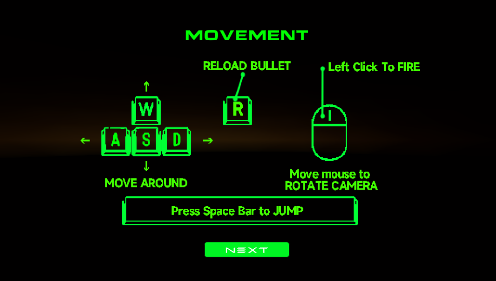
        </p>
<p align="center">
 <em>&nbsp;&nbsp;&nbsp;&nbsp;&nbsp;&nbsp;&nbsp;&nbsp;&nbsp;&nbsp;</em>
  <em>Figure 9. Textual background story.</em> 
<em>&nbsp;&nbsp;&nbsp;&nbsp;&nbsp;&nbsp;&nbsp;&nbsp;&nbsp;&nbsp;&nbsp;&nbsp;&nbsp;&nbsp;&nbsp;&nbsp;&nbsp;&nbsp;&nbsp;&nbsp;</em>
  <em>Figure 10. Instructions on how to play the game.</em>
</p>

We've also added a 5-minute timer on the UI (as shown in Figure 11 below) instead of just having timers within the scene (e.g. on the walls). Since we have a background introduction before the game starts, the timer on the UI will make sense for the players and allow the players to know more about what situation they are in within the game. 

There are still instructions within the game (e.g. when the player is close to the lore note, there will be an instruction saying how to open it) despite the fact that the instructions are shown before the game starts. This is to give the participants some handy reminders. The font and the colour of the texts changed to a more readable style (as shown in Figure 11 below) so they can be more helpful and useful to the players.   

<p align="center">
        
        </p>
<p align="center">
  <em>Figure 11. Improved font and colour of text & timer on UI.</em>
</p>


#### 2.4.2. Fight Between Enemy and Player  

##### Problem identified  
Another three sections that have lots of points lost are *Shooting Experience* (7.9% of the points lost), *Enemy Harm* (7.3% of the points lost), and *Enemy Distribution & Quantity* (7.9% of the points lost). They are all related to the interaction between the enemies and the player. 

The participants tend to run away when they see enemies instead of fighting against them because the player can win the game if they keep running without shooting the enemy - they can survive for 5 minutes using this strategy. This is definitely an option but we don't want it to be what the majority choose. The enemies should put some survival pressure on the player so that they have to shoot at least some of the enemies.

There are many factors that lead to this problem, the major ones are summarized as the following: 
* Enemy requires too many bullets to defeat, so there is not much enjoyment in shooting them
* The enemies can chase the player for the whole duration of the game once they detect the player, which is results in the player being chased by many enemies, reducing the ability and motivation to kill the enemies 
* The enemy harm is too little, so the player can just move through the enemies without losing too much health - running away is too easy so they don't need to fight 

##### Solution 
Some changes to the configuration of the enemies are done:
* Enemy health is reduced to 120 from 500, so the player can now kill an enemy in 6 bullets
* The enemies can only chase the player when the player is within their detecting radius, so if the player keeps running away from an enemy, then the enemy will eventually stop chasing
* The enemy's harm is increased 

After these changes, killing enemies is easier, and fleeing is harder. So there is a higher possibility that the players fight instead of playing it as a "parkour game". 


#### 2.4.3. Interaction Between Enemy and Bullet
##### Problem identified  
One feedback on *Enemy Interaction with Player* (4.8% of the points lost) that we found significant is that **an enemy does not react after the player successfully shoots it from far away**. This is due to the missing logic on enemies' response when bullets collide with them. It is abnormal that they do not respond. 

##### Solution 
We implemented the logic of forcing the enemies to chase the player for a period of time (i.e. 10 sec) after being hit by a bullet, even if the player is not in their detecting radius. 


## 3. Shaders and Special Effects

### 3.1. Shader - Lore Notes

["github link to notesShader"](https://github.com/COMP30019/project-2-undefined/blob/main/Assets/MyGame/Shaders/notesShader.shader)

Path:

Assets/MyGame/Shaders/notesShader.shader

The first shader file that we have custom-written is used onto our presentation of the unique selling point, which is on our notes objects. In this particular setting, this shader involves effects from three major aspects: texture, vertex shader and shading from illumination. Hence, three stages of the rendering pipeline are involved. These are the vertex shading stage, rasterizer stage, as well as the pixel shader stage, also known as fragment shader.

#### 3.1.1. Vertex Shader

We will first discuss the vertex shader stage in the rendering pipeline. As discussed in the workshops, we’ve implemented a “sine” wave effect towards the object. From the projection perspective, we’ve decided to use the default MVP transform process of the shader file within unity engine, where we map the object from model space towards the world space, then to view coordinates and finally towards the projection onto screen. Before transforming into a MVP matrix from vertex coordinates, here is the implementation done to create the effects.

<p align="center">
        
        </p>
<p align="center">
  <em>Vertex Shader of Notes.</em>
</p>

From the time that the scene of unity engine has been activated, it brings a transposed effect using the sine function on the vertex of y axis based on the location of its z-axis points. Hence, the object itself will be blended with a sine wave. This harmonically merges into our design of “notes” objects, since these objects are displayed and presented as floating papers. On top of the wave effect itself, we’ve also added a sine wave uniquely from time value, so that the object on display will float up and down representing as a “notes” that is scattered based on our GDD. 

At this stage, we also record the world coordinates and normal coordinates and pass it to output for the pixel shader we will explore later on.

After the MVP matrix is getting generated and converted, it brings the effect into the rasterizer stage converting into pixels, we have arrived at the pixel shader or fragment shader stage.

At this stage, multiple effects are implemented and involved and blended in. These effects are: a modified phong shader for illumination, a glowing effect of the object itself, as well as mapping the texture onto the output.

<p align="center">
        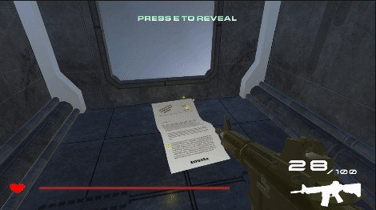
        </p>
<p align="center">
  <em>Pixel Shader of Notes.</em>
</p>

#### 3.1.2. Shader - Fragment

Based on our design, the notes object should become brighter as the player walks closer towards the object, looking like an effect from a searchlight. Therefore, the looking of notes should be different while the distance between position of the player and position of notes.

Therefore, for an illumination model that matches with our game’s art style, a phong shader will be most suitable, since it will first detect normal, at each vertex, linearly interpolate and apply the illumination model. This will ensure that the illumination is smooth. 

Here are the parameters that we pass into from a external C# script. 

<p align="center">
        
        </p>
<p align="center">
  <em>Script Manipulating Variables.</em>
</p>

At initialisation, the external script will set the parameters for optimization of the phong model. Since our notes are placed at static locations, hence these parameters vary as the notes are placed at different locations within the map, and tuned by the developers for best presentation.
```
_Ka("Ka", Float)
_Kd("Kd", Float)
_Ks("Ks", Float)
_fAtt("fAtt", Float)
_specN("specN", Float)
```
The values Ka Kd Ks are constants respectively for ambience, diffusion and specular. While the fAtt is the attenuation factor and specN is the power and shininess of the light. We designed it to be shiny so that the notes can be easily identified by players. So we have a high magnitude of power of specular but not overly high so the light does not block the entire surface of the note.

These
```
_PointLightColor("Point Light Color", Color)
_PointLightPosition("Point Light Position", Vector)
```
Point Light Color refers to the color of the light model we want to create effect onto the notes paper. The external script will update the parameters in real time. The color is set to be white all the time, but the light position is set to be the position that is one level higher than the actual of the player on y axis. Since our notes are single sided only and placed on the ground, this ensures that the light is always on top of the notes, and it will affect the effect on notes.

To make the effect of illumination more smoothly projected onto the notes surface, we’ve used the Blinn-Phong approximation to enhance the smoothness of the light.

To create the growing effect besides the phong shader itself, we’ve modified the ambient color, using a sine wave based on the current time of game to arrange the ambient value for a glowing effect. It is dynamic, so the players can notice the “notes” easily while playing the game. There is also a minimum threshold set so that the object will not turn completely dark.

<p align="center">
        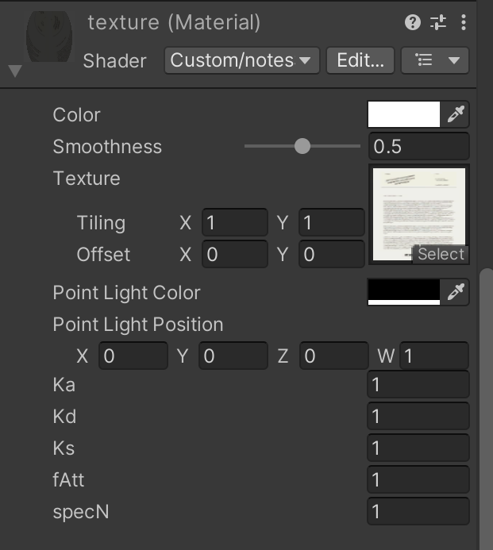
        </p>
<p align="center">
  <em>Material Manipulating Variables.</em>
</p>

The following parameters are from the material to parameterise the shader.

After all, we have also customly created a texture.
```
_MainTex ("Texture", 2D)
```

This is imported from the unity engine by applying a texture file onto the shader file. Since it is a flat surface, we can directly apply it onto the uv coordinates without further adjustments or tiling or offset. And we merge it with the Phong shader’s output color previously implemented.

```
_Glossiness ("Smoothness", Range(0,1))
```

There is also a glossiness value passed in from the unity engine on start, we also merge this into our final return color by modifying the alpha value of output color.

With the vertex shader and the fragment shader, we have effectively reduced the burden of CPU since there are 15 notes scattered around the map. By allocating the tasks of displaying towards the GPU. 

It is also surrounded by an particle effecrt to enhance the presentation and subtleness, however this is not the particle effect will be marked on.


### 3.2. Shader - Boss Jump Attack 
["github link to bossJumpShader"](https://github.com/COMP30019/project-2-undefined/blob/main/Assets/MyGame/Shaders/bossJumpShader.shader)

path:
Assets/MyGame/Shaders/bossJumpShader.shader

For the second shader, the design of the shader itself involves more creative thinking and imagination. The second shader is applied onto the attacking object that the boss creates whenever performing a jump (range) attack.

#### 3.2.1. Vertex Shader

Same as the previous shader, we will first talk about the vertex shader stage of the pipeline. This time, the shader involves a external parameter passed in from a C# script, which is the time taken since the object is created. 

<p align="center">
        
        </p>
<p align="center">
  <em>Final effect of the shader.</em>
</p>

The attack should be a circular shape, therefore, we have customly created a prefab of a circle panel using a flattened sphere.

<p align="center">
        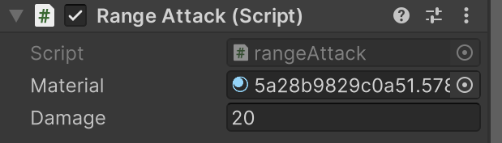
        </p>
<p align="center">
  <em>Script Manipulating Variables.</em>
</p>

Here is the variable that passed in by C# script and updating dynamically.
```
_instantiateTime ("_instantiateTime", Range(0, 4))
```
For this particular effect, we want the player to see that the range attack is gradually expanding towards the surrounding, centered with the boss itself. Therefore, we first calculate the scale of the object to be displayed based on the time that has passed in, using the square of the value to increase the size at an increasing speed, until reaching a maximum scale. 

<p align="center">
        
        </p>
<p align="center">
  <em>Displacement and scale changes.</em>
</p>

We also want the effect to be dynamic, with part of the surface above the surface and alternating in a unique way. Therefore, we have set the y axis of the displacement to be a sum of cosine of x axis and sine of z axis, each with the instantiateTime variable passed inside. Since we are also using a square of it here, the multi-wave effect will display at an increasing speed.

<p align="center">
        
        </p>
<p align="center">
  <em>View Space displacement.</em>
</p>

Apart from this, we want to play to see a slightly different effect when they are moving towards different perspectives watching the plane. As discussed previously for the MVP transformation, we apply the multi-wave effects in between MV and P, which means it is manipulated in view space. Hence apart from the moving effect created by itself, as the player moves around, the effect becomes more dramatic and much more magical and significant. After the entire MVP transformation, it is output to the rasterizer stage and finally the pixel or fragment shader stage.

#### 3.2.2. Fragment Shader

To further enhance the drastic effect of the range attack circle, we create a spinning effect.

We first mapping the texture towards the correct centre, which is 0.5 and 0.5. From the time variable we have passed in dynamically, we calculated both the angle of rotation and cosine angle of rotation, and created a matrix. From the offset of the mapping as well as the uv, the texture keeps getting rotated in a linear speed.

<p align="center">
        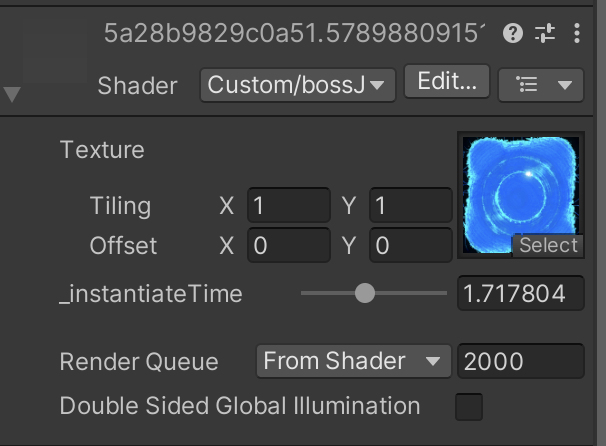
        </p>
<p align="center">
  <em>Material Manipulating Variables.</em>
</p>

Finally using the texture we have gathered from online resources, imported into the material and applied with the shader.
```
_MainTex ("Texture", 2D) 
```
We blend the rotation of spinning together with the uv mapping of the texture, create output of colour and exit the pixel shading stage.


### 3.3. Particle System - Boss Swipe Attack

To further enhance the power of attack from the boss, as well as the visual impact of the game bringing towards the player, we’ve also implemented a particle system, using it as the weapon from the boss when it performs a remote swipe attack.

<p align="center">
        
        </p>
<p align="center">
  <em>Boss performing Swipe Attack.</em>
</p>


The particle effect would effectively be a flowing blade, flying directly towards the player attempting to create damage onto the player. Therefore, the blade should be dynamic, displaying as a shape of a sector, with a matching colour style as the boss itself.

In this report, we’ll specifically discuss the intuition behind the settings we have modified.

#### General:
Since the blade should be an object that exists constantly until reaching a maximum time of life, we set the particle effect to loop overtime. Since it is intentionally designed as a blade, setting the max particles to a high value makes the density of the particles to be enough so that players can easily notice and dodge the destructive remote attack. To further exhibit the deterrent of the attack, we want the small but dense particles to flow at a relatively fast constant speed, and each particle should begin from the centre and  disappear quickly when reaching the edge of the sector, which takes 0.2s. 

Also to make it look more artistic, we also allow random seeds so the particles are not exactly identical. The particles are not subjected to gravity effects due to its nature in design, so that boss is able to attack the players at various angles. The life cycle of the blade should be from instantiate to destruction, start to play the particle whenever blade is generated and ends when it is destroyed.

<p align="center">
        
        </p>
<p align="center">
  <em>Particle System of blade.</em>
</p>

#### Emission:

As mentioned earlier about the density of the particle system, we set the rate over time of emission to be very high to achieve this outcome.

#### Shape: 

Based on the scale of the boss model, we’ve tuned the radius of the shape, arc, and rotation to ensure that whenever the boss performs a swipe attack, the direction of the blade is always towards the player, with a suitable size that matches with animation and scale of the boss itself. To form a sector or a blade, the shape is extracted from a sphere with a small arc, removing the central portion of the sphere.

#### Velocity, Color, and Size over time:

As the particle reaches the edges of the sector, it moves slower over time. To explicitly expose the expressiveness of this action, the colour of each particle gradually changes from a light blue colour towards a white colour, that matches with the colour tone of the boss’ arm with a blade. The white colour at the edge demonstrates the sharpness of the blade, while the blue part displays the powerfulness. The impact is strengthened as the size of each particle decreases over time. 

#### Noise:

To make the blades thicker, we also attached the particle effect with randomness by adding noise factors. To preserve the sector shape of the particle system, we set a relatively small strength and frequency.

<p align="center">
        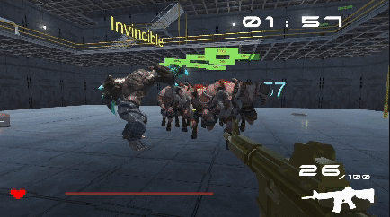
        </p>
<p align="center">
  <em>Light Effect of Particle System.</em>
</p>

#### Lights:

For a greater global impact and graphics within the game, we also attach some of the point lights within the particle system. Therefore, when reaching onto a wall, the shininess of the effect passing through will be displayed on walls. To not make it overly flashy or contain high exposure, we set the intensity range and ratio to be default of 1. This also makes sure that the game’s performance in terms of refresh rate does not drop significantly.

For the renderer, we’ve selected the default settings, for purposes of preserving best performance across various computers. The shadows are switched off, since its design and existence does not follow realism. 


## 4. Summary of Contributions

Yilu Wang
* Enemy animation and logic
* Boss animation and logic
* Timer logic
* Analysis on interview data & evaluation plan finalization 

Wancheng Tang
* Player logic
* Bullet and gun animation and logic 
* UI
* Analysis on post-task walkthrough data 

Tianxi Chen
* Setting up the scene
* Special visual effects and sound effects
* Lore notes design and implementation
* Shader and particle system evaluation 

Hao Xu
* Crate animation and logic
* Potion animation and logic
* AI NavMeshAgent
* Diagrams for the report

Above is a rough summary of the primary responsibilities of each team member during development.

But thanks to the whole team for contributing to the discussion during meetings and helping each other throughout. 

This is a work of the teams instead of the combination of separate works of each team member. :)


## 5. References and External Resources

[1] https://www.cleanpng.com/png-walker-s-revenge-bullet-metal-bullet-holes-805148/

[2] https://www.cleanpng.com/png-white-symmetry-structure-pattern-vector-shot-trans-453234/

[3] https://assetstore.unity.com/packages/3d/characters/minotaur1-196863

[4] https://www.mixamo.com/#/?page=1&type=Character

[5] https://assetstore.unity.com/packages/3d/environments/sci-fi/sci-fi-construction-kit-modular-159280

[6] https://assetstore.unity.com/packages/audio/ambient/sci-fi/sci-fi-alarm-sfx-238043

[7] https://assetstore.unity.com/packages/audio/sound-fx/classic-footstep-sfx-173668

[8] https://assetstore.unity.com/packages/audio/sound-fx/foley/door-cabinets-lockers-free-257610

[9] https://assetstore.unity.com/packages/audio/ambient/sci-fi/sci-fi-ambiant-power-174139

[10] https://assetstore.unity.com/packages/3d/props/guns/sample-low-poly-guns-pack-207957

[11] https://assetstore.unity.com/packages/3d/props/food/health-potion-bottle-set-204920

[12] https://assetstore.unity.com/packages/3d/nextgen-sci-fi-crate-45877

[13] https://www.bing.com/images/search?view=detailV2&ccid=t6XVmwuM&id=9D4B3E61164A11736FC3076C6A38A4482B30626D&thid=OIP.t6XVmwuM1vmTmpz11ktvjwHaEK&mediaurl=https%3a%2f%2fimages3.alphacoders.com%2f109%2f1092510.jpg&exph=2160&expw=3840&q=robot+in+scifi+experiment&simid=608045362569430795&FORM=IRPRST&ck=98606F7DB3EED41FC3BF13BF66F9B35D&selectedIndex=24&ajaxhist=0&ajaxserp=0

[14] https://pixabay.com/sound-effects/

[15] https://assetstore.unity.com/packages/audio/music/cinematic-trailer-music-collection-240943

[16] https://assetstore.unity.com/packages/audio/music/absolute-space-sci-fi-music-free-sample-103274

[17] https://588ku.com/ycpng/13385578.html

[18] https://588ku.com/ycpng/13347983.html

[19] https://588ku.com/ycpng/13378576.html

[20] https://www.fontspace.com/

[21] https://www.flaticon.com/free-icon/
